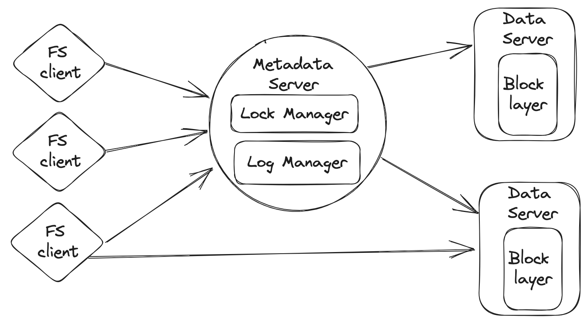

## Lab 1:

实现一个基于inode的文件系统

文件系统由三个层次组成：block层、inode层和filesystem层。

block层实现了一个块设备，提供了用于alloc/dealloc block、从block读取/写入数据的API。

inode层以inode的形式管理块层提供的block。这一层提供了用于alloc/dealloc inode、从这些inode读取/写入数据的API。super
block也在这一层，记录了文件系统的一些关键信息。

文件系统层提供了一些基本的文件系统API，包括文件操作API和目录操作API

1. **超级块（Superblock）：**
    - 超级块是文件系统的元数据之一，包含有关整个文件系统的信息。这些信息可能包括文件系统的总体大小、可用空间、块大小、Inode
      数量等。超级块通常位于文件系统的固定位置。

2. **Inode（索引节点）：**
    - Inode 是文件系统中的关键数据结构，每个文件或目录在文件系统中都有一个唯一的 Inode。Inode
      记录了文件的元数据，如文件大小、所有者、权限、时间戳和文件数据块的位置等。
    - Inode 中可能包含直接指向数据块的指针，这些指针可以直接引用文件数据块，而不需要间接寻址。对于大文件，可能还有一些间接块，用于寻址更多的数据块。

3. **数据块（Data Block）：**
    - 数据块是实际存储文件内容的地方。Inode 包含指向数据块的指针，这些指针指向文件的实际数据。数据块可以包含文件的文本、二进制数据等。对于小文件，数据块可能直接存储在
      Inode 中。

4. **目录项（Directory Entry）：**
    - 目录项用于组织文件系统中的文件和目录。每个目录项包含文件名和对应的 Inode
      号码。目录文件本质上是一个包含目录项的文件，其中每个目录项指向文件系统中的一个文件或子目录。

**完成了以下文件系统API**

- `open`
- `getattr`
- `readdir`
- `read`
- `mknode`
- `mkdir`
- `unlink`
- `write`
- `setattr`
- `lookup`

## Lab 2:

实现了类似GFS的Distributed Filesystem

文件系统由三个组件组成：**filesystem client**, **metadata server**, and **data server**

一个文件被分割成一个或多个块，这些块被存储在一组数据服务器上。文件系统负责处理来自文件系统客户端的读写请求，以及来自元数据服务器的块创建和删除等指令。

元数据服务器是维护所有文件系统元数据的服务器。它存储文件的inode和其他元数据，例如每个块的位置（MacId）和此机器上的`block_id`
。此外，它负责提供元数据操作，如文件的创建、删除，以及查询用于读写的数据块位置。**只有一个元数据服务器（没有replica）。
**

文件系统客户端通过向元数据服务器和数据服务器发出RPC来实现文件系统逻辑

实现了log系统，使用 redo-logging 来确保文件系统 metadata 操作是全有或全无的原子操作

**完成了以下文件系统API**

- `mknode`
- `unlink`
- `lookup`
- `readdir`
- `get_type_attr`
- `read_file`
- `write_file`
- `free_file_block`

## Lab 3:

**Raft** 是一种用于复制日志的一致性算法。Raft将共识问题分解为相对独立的子问题，这些子问题更容易理解。
Raft中的关键数据结构是 **log**，它将客户端的请求组织成一个序列。
Raft保证所有服务器将以相同的顺序 **应用相同的日志命令**，这意味着所有服务器将处于一致的状态。
如果服务器发生故障但后来恢复，Raft会负责将其日志更新。
只要至少占多数的服务器处于运行状态并连接，Raft就可以正常工作。

Raft通过首先在服务器之间选举一个领导者（第一部分）
然后赋予领导者管理日志的权限和责任来实现共识。领导者接受来自客户端的日志条目，将其复制到其他服务器，并告诉服务器何时可以安全地将日志条目应用于它们的状态机（第二部分）
日志应该持久保存在非易失性存储上，以容忍机器崩溃（第三部分）
随着日志的增长，Raft将通过快照来紧缩日志（第四部分）

遵循Raft论文的描述。**Raft论文的[扩展版本](https://raft.github.io/raft.pdf)**

- 在第1部分，实现Raft的领导者选举和心跳机制。
- 在第2部分，实现Raft的日志复制协议。
- 在第3部分，持久保存Raft日志。
- 在第4部分，实现Raft的快照机制。

## Lab 4: MapReduce With Distributed File System

在之前实现的分布式文件系统的基础上构建一个MapReduce框架。

实现一个工作进程，调用Map和Reduce函数，处理文件的读取和写入，并实现一个协调进程，将任务分配给工作进程，并处理失败的工作进程。

[MapReduce论文](https://www.usenix.org/legacy/events/osdi04/tech/full_papers/dean/dean.pdf)
以获取更多详细信息（请注意，此实验使用 "coordinator" 而不是论文中的 "master"）

在Part2中，实现一个分布式MapReduce 组成。将只有一个协调器进程，但会有一个或多个并发执行的工作进程。工作进程应通过RPC与协调器通信。
每个工作进程将向协调器请求任务，从一个或多个文件中读取任务的输入，执行任务，并将任务的输出写入一个或多个文件。
如果工作进程在合理的时间内没有完成其任务，协调器应该注意到这一点，并将相同的任务分配给另一个工作进程。

